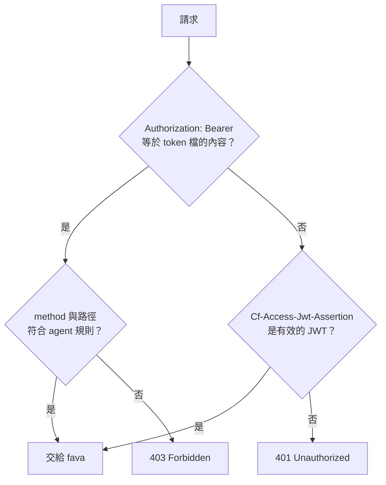
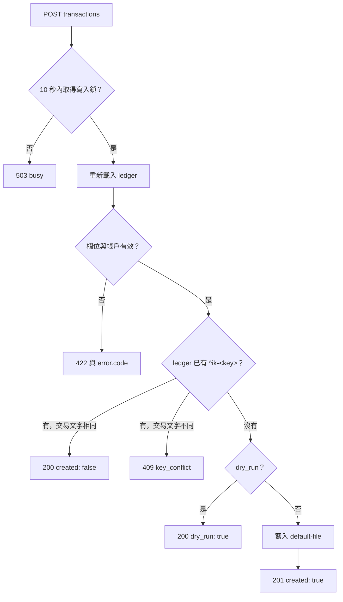

# agent API 參考

本文列出 guard 的規則、agent 可以呼叫的端點、欄位與回應碼。架構與部署步驟見 [agent-api.md](agent-api.md)。

下文的 `<bfile>` 是 ledger 的 URL slug，例如 `beancount`。

## 環境變數

fava container 讀取這些變數。

| 變數 | 值 | 說明 |
|---|---|---|
| `BEANCOUNT_FILE` | `/ledger/main.beancount` | ledger 主檔的絕對路徑。多個檔以 `:` 分隔。 |
| `AGENT_API_TOKEN_FILE` | `/run/secrets/agent-token` | agent token 檔的路徑。檔案讀不到或是空的時，container 停止。 |
| `CF_ACCESS_TEAM_DOMAIN` | `https://<team>.cloudflareaccess.com` | JWT 的 `iss` 必須等於這個值。公鑰從 `<值>/cdn-cgi/access/certs` 取得。 |
| `CF_ACCESS_AUD` | `<aud-tag>` | JWT 的 `aud` 必須等於這個值。 |
| `FAVA_HOST` | `0.0.0.0` | fava 監聽的位址。image 的預設值是 `0.0.0.0`，port 固定是 5000。 |

至少要設定 `AGENT_API_TOKEN_FILE`，或同時設定兩個 `CF_ACCESS_*` 變數。只設定一個 `CF_ACCESS_*` 變數時，container 停止。

Agent 這一端讀取 `BEANCOUNT_AGENT_TOKEN`（token 的值）與 `BEANCOUNT_FAVA_URL`（例如 `http://192.168.2.11:5656/beancount`）。

## 憑證與路徑規則

guard 對每個請求依這個順序判斷。



有效的 JWT 符合這些條件。fava 不讀 `CF_Authorization` cookie。

- 簽章是 RS256，`kid` 是 team 公鑰中的一把。
- `aud` 等於 `CF_ACCESS_AUD`，`iss` 等於 `CF_ACCESS_TEAM_DOMAIN`。
- `exp` 還沒到。

| 身分 | method | 路徑 | 結果 |
|---|---|---|---|
| 瀏覽器 | 全部 | 全部 | 交給 fava |
| agent | `GET` | `/<bfile>/api/<endpoint>` | 交給 fava |
| agent | `POST` | `/<bfile>/extension/AgentApi/<endpoint>` | 交給 extension |
| agent | 全部 | `/<bfile>/extension/AgentApi/mcp` | 交給 extension |
| agent | 其他 | 其他 | `403 Forbidden` |

`<endpoint>` 是一段路徑，不含 `/`。401 的 header 有 `WWW-Authenticate: Bearer realm="fava"`。401 與 403 的 body 是純文字的狀態列。

## fava 的 GET 端點

fava 1.30.16 的 GET 端點都開放給 agent：`account_report`、`balance_sheet`、`changed`、`commodities`、`context`、`documents`、`errors`、`events`、`extract`、`help`、`imports`、`income_statement`、`journal`、`journal_page`、`ledger_data`、`narration_transaction`、`narrations`、`options`、`payee_accounts`、`payee_transaction`、`query`、`source`、`source_slice`、`statistics`、`trial_balance`。

`GET /api/source` 回傳 ledger 檔的全文，所以持有 token 的人可以讀整本帳。Skill 只用 `ledger_data` 與 `query`。

| 用途 | 請求 | 回應中要讀的欄位 |
|---|---|---|
| 讀帳戶 | `GET /<bfile>/api/ledger_data` | `data.accounts` 是帳戶全名。`data.account_details["<帳戶>"].meta["name-zh"]` 是中文別名。 |
| 查交易 | `GET /<bfile>/api/query?query_string=<BQL>` | `data.rows` 與 `data.types`。 |
| 查帳本錯誤 | `GET /<bfile>/api/errors` | `data` 是錯誤清單。 |

fava 的 PUT 與 DELETE 端點對 agent 回 403：`PUT` 的 `add_document`、`add_entries`、`attach_document`、`format_source`、`move`、`source`、`source_slice`、`upload_import_file`，以及 `DELETE` 的 `document`、`source_slice`。

## `POST /<bfile>/extension/AgentApi/transactions`

新增一筆交易。錢從 `source` 流到 `target`。body 是 JSON 物件，`Content-Type` 是 `application/json`。

### 欄位

| 欄位 | 必填 | 型別 | 規則 |
|---|---|---|---|
| `source` | 是 | string | 錢流出的帳戶。可以是帳戶全名、完整的 `name-zh`，或 `name-zh` 以 `/` 分段的最後一段。 |
| `target` | 是 | string | 錢流入的帳戶。格式同 `source`。 |
| `amount` | 是 | string | `[0-9]{1,15}(\.[0-9]{1,2})?`，大於 0。 |
| `key` | 是 | string | `[A-Za-z0-9\-_/.]+`。寫成 link `^ik-<key>`。 |
| `date` | `date` 與 `time` 擇一 | string | `YYYY-MM-DD`。 |
| `time` | `date` 與 `time` 擇一 | string | RFC 3339，要有時區，例如 `2026-09-25T07:00:00+08:00`。fava 換算成 `Asia/Taipei` 的日期，並加上 metadata `time: "07:00:00"`。 |
| `currency` | 否 | string | 預設是第一個 `operating_currency`。兩個帳戶都必須接受這個幣別。 |
| `narration` | 否 | string | 說明，例如品名。預設是空字串。不能有 Unicode 類別 `Cc`、`Cs`、`Zl`、`Zp` 的字元。 |
| `payee` | 否 | string | 交易對象，例如店家或代墊人。規則同 `narration`。空字串等於沒有 payee。 |
| `tags` | 否 | string 陣列 | 每個 tag 只能用 `[A-Za-z0-9\-_/.]`，不含 `#`。重複的 tag 只寫一次。beancount 不接受中文 tag。 |
| `meta` | 否 | 物件，值是 string | 交易的 metadata，例如 `{"note": "還代墊"}`。key 是 `[a-z][a-zA-Z0-9\-_]*`。`time`、`filename`、`lineno` 是保留的 key。值的規則同 `narration`。 |
| `dry_run` | 否 | boolean | `true` 時回傳交易文字，不寫入。 |

其他規則：

- 不接受上表以外的欄位。`links` 不開放，`^ik-<key>` 是唯一的 link。
- 日期不能晚於 `Asia/Taipei` 的今天加 366 天。
- 帳戶在該日期必須是開啟的。開帳日不能晚於該日期。帳戶有關帳日時，關帳日不能早於該日期。
- `source` 與 `target` 不能是同一個帳戶。

### 寫入的交易

交易一律是 `!` flag。`target` 是正數，`source` 是負數。tag 依字母排序。metadata 依 key 排序，包含 `time`。

以測試用的 ledger 為例，「錢包」是 `Assets:TW:Cash`，「晚餐」是 `Expenses:Food:Dinner`。

請求：

```json
{
  "date": "2026-09-24",
  "source": "錢包",
  "target": "晚餐",
  "amount": "190",
  "payee": "小明",
  "narration": "手機",
  "tags": ["reimburse", "family"],
  "meta": {"via": "line-pay", "note": "還代墊"},
  "key": "r1"
}
```

寫入的交易：

```beancount
2026-09-24 ! "小明" "手機" #family #reimburse ^ik-r1
  note: "還代墊"
  via: "line-pay"
  Expenses:Food:Dinner                                  190 TWD
  Assets:TW:Cash                                       -190 TWD
```

以 `"tags": ["family", "reimburse", "family"]` 與 `"meta": {"note": "還代墊", "via": "line-pay"}` 重送同一個 key，回 200 與同一筆交易。只送 `"tags": ["reimburse"]` 則回 409。

### 處理順序與冪等



比較交易文字時不比較 flag，所以已核准成 `*` 的交易也算相同。tag 與 metadata 已排序，所以重送時欄位的順序不影響結果。

使用者在 fava 核准時如果同時修改了交易（例如 narration、tag 或 metadata），之後以同一個 key 重送會得到 409。

fava 寫入前不檢查整本帳。201 的 `errors` 是寫入前後 fava 的錯誤數量，兩者不同時要檢查帳本。

### 回應

| 狀態 | body | 意思 |
|---|---|---|
| 201 | `{"created": true, "link", "entry", "errors": {"before", "after"}}` | 已寫入。`entry` 是交易文字。 |
| 200 | `{"created": false, "link", "entry"}` | 同一個 key 已有相同的交易，沒有寫入。 |
| 200 | `{"created": false, "dry_run": true, "link", "entry"}` | 預覽，沒有寫入。 |
| 409 | `{"error": {...}, "entry"}` | `code` 是 `key_conflict`。這個 key 已用在另一筆交易。`entry` 是既有交易的文字。 |
| 422 | `{"error": {...}}` | 請求不符合規則。`code` 見下表。 |
| 503 | `{"error": {...}}` | `code` 是 `busy`。另一筆寫入還沒完成。以同一個 key 重送。 |
| 401 | `401 Unauthorized` | 沒有憑證或憑證無效。 |
| 403 | `403 Forbidden` | 這個身分不能用這個 method 或路徑。 |

`error` 物件一律有 `field`、`code`、`message`、`candidates` 四個欄位。`candidates` 只在 `ambiguous_account` 時有內容。`message` 說明怎麼修正。

| 422 的 `code` | `field` | 原因 |
|---|---|---|
| `invalid_body` | 空字串 | body 不是 JSON 物件。 |
| `unknown_field` | 該欄位 | 不接受的欄位。 |
| `invalid_type` | 該欄位 | 型別錯誤。`dry_run` 要是 boolean，`tags` 要是 string 陣列，`meta` 要是值為 string 的物件，其他要是 string。 |
| `missing` | 該欄位 | 缺少必填欄位，或 ledger 沒有 `operating_currency` 且請求沒有 `currency`。 |
| `invalid_key` | `key` | key 有不允許的字元。 |
| `date_or_time` | `date` | `date` 與 `time` 都有或都沒有。 |
| `invalid_date` | `date` | 不是 `YYYY-MM-DD` 或不是有效日期。 |
| `invalid_time` | `time` | 不是帶時區的 RFC 3339。 |
| `date_out_of_range` | `date` 或 `time` | 日期晚於今天加 366 天。 |
| `invalid_amount` | `amount` | 格式錯誤、超過兩位小數或不大於 0。 |
| `invalid_currency` | `currency` | 不是幣別代碼。 |
| `invalid_narration` | `narration` | 有換行或控制字元。 |
| `invalid_payee` | `payee` | 有換行或控制字元。 |
| `invalid_tag` | `tags` | tag 是空字串，或有 `[A-Za-z0-9\-_/.]` 以外的字元。 |
| `invalid_meta_key` | `meta` | key 不符合 `[a-z][a-zA-Z0-9\-_]*`。 |
| `reserved_meta_key` | `meta` | key 是 `time`、`filename` 或 `lineno`。 |
| `invalid_meta_value` | `meta` | 值有換行或控制字元。 |
| `invalid_account_name` | `source` 或 `target` | 不是別名，也不是有效的帳戶名稱。 |
| `unknown_account` | `source` 或 `target` | 帳戶名稱有效，但 ledger 沒有開這個帳戶。 |
| `ambiguous_account` | `source` 或 `target` | 別名符合多個帳戶，`candidates` 列出它們。 |
| `account_not_open` | `source` 或 `target` | 日期早於開帳日。 |
| `account_closed` | `source` 或 `target` | 日期晚於關帳日。 |
| `same_account` | `target` | `source` 與 `target` 是同一個帳戶。 |
| `currency_not_allowed` | `currency` | 帳戶不接受這個幣別。 |

## MCP 端點 `/<bfile>/extension/AgentApi/mcp`

### 協定

- 只支援 MCP `2026-07-28`。每個請求獨立處理，回應一律是 JSON，沒有 SSE。
- 支援的方法：`server/discover`、`tools/list`、`tools/call`。
- notification（沒有 `id`）回 202，沒有 body。
- 其他方法（包含 `initialize`、`ping`、`resources/list`）回 HTTP 404 與 `-32601`。
- 每個請求都要有 `MCP-Protocol-Version` 與 `Mcp-Method` header。`tools/call` 另要 `Mcp-Name`。header 與 body 不符時回 400 與 `-32020`。
- `params._meta` 必須有 `io.modelcontextprotocol/protocolVersion` 與 `io.modelcontextprotocol/clientCapabilities`。缺少時回 400 與 `-32602`。
- 版本不是 `2026-07-28` 時回 400 與 `-32022`，`data.supported` 是 `["2026-07-28"]`。
- body 不是單一 JSON 物件（例如 batch 陣列）時回 400 與 `-32600`。body 不是 JSON 時回 400 與 `-32700`。
- 請求有 `Origin` header 時回 403 與 `-32600`。
- `GET`、`PUT`、`DELETE` 回 405，header 有 `Allow: POST`。
- 每個結果都有 `resultType: "complete"`。`server/discover` 與 `tools/list` 另有 `ttlMs: 3600000` 與 `cacheScope: "private"`。
- 每個請求在 container 的 stderr 寫一行 `mcp <method> <tool> <HTTP 狀態> [附註]`，例如 `mcp tools/call add_transaction 200`。

### tool

| tool | 參數 | 結果 |
|---|---|---|
| `list_accounts` | 無 | 與 `GET /<bfile>/api/ledger_data` 的 body 相同。 |
| `query` | `query_string`（BQL，必填） | 與 `GET /<bfile>/api/query` 的 body 相同，但沒有 fava 的篩選條件。 |
| `add_transaction` | 與 `POST transactions` 的欄位相同，包含 `payee`、`tags`、`meta` | 與 `POST transactions` 的 body 相同。 |

`tools/call` 的結果有三個欄位。

- `content`：一個 text，內容是 body 的 JSON 文字。
- `structuredContent`：同一個 body。
- `isError`：body 對應的 HTTP 狀態是 400 以上時為 `true`，例如 422 的驗證錯誤。MCP 的 HTTP 狀態仍是 200。

未知的 tool 回 400 與 `-32602`。

### 範例

```http
POST /beancount/extension/AgentApi/mcp HTTP/1.1
Authorization: Bearer <token>
Content-Type: application/json
MCP-Protocol-Version: 2026-07-28
Mcp-Method: tools/call
Mcp-Name: add_transaction

{"jsonrpc": "2.0", "id": 1, "method": "tools/call",
 "params": {"name": "add_transaction",
            "arguments": {"date": "2026-09-24", "source": "錢包", "target": "晚餐",
                          "amount": "190", "narration": "晚餐", "key": "20260924-dinner-190"},
            "_meta": {"io.modelcontextprotocol/protocolVersion": "2026-07-28",
                      "io.modelcontextprotocol/clientCapabilities": {}}}}
```
