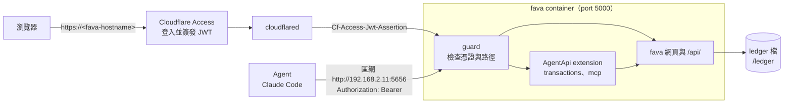
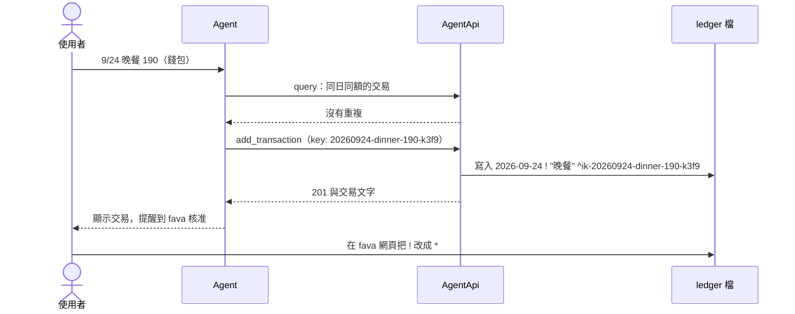

# fava 的 agent API

這個 image 的 fava 對每個請求檢查憑證。瀏覽器經由 Cloudflare Access 登入。Agent（例如 Claude Code）在區網以 Bearer token 連線，可以讀帳本與新增交易。

本文說明架構與部署步驟。端點、欄位與回應碼見 [API 參考](agent-api-reference.md)。

## 架構

每個請求先經過 guard。guard 依憑證判斷身分，再依身分、method 與路徑決定是否交給 fava。



| 身分 | 憑證 | 可以做的事 |
|---|---|---|
| 瀏覽器 | Cloudflare Access 的 JWT | fava 的全部功能，包含核准、修改、刪除交易 |
| Agent | Bearer token | 讀 fava `/api/` 的 GET 端點。經由 `AgentApi` 新增 `!` 交易 |
| 其他 | 沒有或無效 | 一律 401 |

Agent 不能修改、刪除或核准交易。這些請求回 403。

## 記一筆帳的流程

Agent 新增的交易一律是 `!`（待核准）。使用者在 fava 網頁把 `!` 改成 `*`，就是核准。



同一個 `key` 只會寫入一次。Agent 在逾時或連線中斷後，以同一個 `key` 重送，不會寫入第二筆。

## 部署到 Unraid

下列步驟使用這些值。角括號中的值請換成你的值。

| 項目 | 值 |
|---|---|
| fava 的區網網址 | `http://192.168.2.11:5656`（container 的 5000 port） |
| container 的使用者 | `99:100`（Extra Parameters 中的 `--user 99:100`） |
| ledger 目錄 | 主機 `/mnt/user/appdata/beancount/ledger`，container `/ledger` |
| ledger 主檔 | `/ledger/main.beancount`，URL slug 是 `beancount` |
| token 檔 | 主機 `/mnt/user/appdata/beancount/agent-token`，container `/run/secrets/agent-token` |
| Cloudflare Access 的 team | `<team>` |
| fava application 的 AUD tag | `<aud-tag>` |
| fava 的 Cloudflare 網址 | `https://<fava-hostname>` |

步驟 1 到 3 要在更新 image 之前完成。image 啟動時檢查憑證設定，設定不足時 container 以結束碼 1 停止。

### 1. 建立 token 檔

在 Unraid 的終端機執行這些指令。

```sh
(umask 077 && openssl rand -hex 32 > /mnt/user/appdata/beancount/agent-token)
chown 99:100 /mnt/user/appdata/beancount/agent-token
chmod 400 /mnt/user/appdata/beancount/agent-token
```

- token 檔放在 ledger 目錄外。
- uid 99 必須能讀這個檔。檔案不能是空的。fava 會去掉 token 前後的空白與換行。
- fava 只在啟動時讀 token 檔。更換 token 後，重新啟動 container。

### 2. 取得 team domain 與 AUD tag

1. 在 Cloudflare dashboard 開啟 **Zero Trust** > **Settings**。記下 team domain `<team>.cloudflareaccess.com`。
2. 開啟 **Zero Trust** > **Access controls** > **Applications**。在 fava 的 application 選 **Configure**。在 **Additional settings** 複製 **Application Audience (AUD) Tag**。

這兩個值不是秘密。fava 要能連到 `https://<team>.cloudflareaccess.com/cdn-cgi/access/certs` 取得公鑰。連不到時，瀏覽器的請求得到 401，agent 的 token 不受影響。

### 3. 更新 container 設定

在 Unraid 的 **Docker** 頁面編輯 fava container。

1. 新增一個 **Path**。**Container Path** 是 `/run/secrets/agent-token`，**Host Path** 是 `/mnt/user/appdata/beancount/agent-token`，**Access Mode** 是 **Read Only**。
2. 新增 **Variable** `AGENT_API_TOKEN_FILE`，值是 `/run/secrets/agent-token`。
3. 新增 **Variable** `CF_ACCESS_TEAM_DOMAIN`，值是 `https://<team>.cloudflareaccess.com`。值要以 `https://` 開頭。
4. 新增 **Variable** `CF_ACCESS_AUD`，值是 `<aud-tag>`。
5. 保留 `BEANCOUNT_FILE=/ledger/main.beancount`、ledger 的 Path、`--user 99:100` 與 5656 對 5000 的 port。
6. **Post Arguments** 保持空白。不要把指令改成 `fava`（見「風險」）。

同樣的設定以 `docker run` 表示如下。

```sh
docker run -d --name beancount-fava --user 99:100 -p 5656:5000 \
  -v /mnt/user/appdata/beancount/ledger:/ledger \
  -v /mnt/user/appdata/beancount/agent-token:/run/secrets/agent-token:ro \
  -e BEANCOUNT_FILE=/ledger/main.beancount \
  -e AGENT_API_TOKEN_FILE=/run/secrets/agent-token \
  -e CF_ACCESS_TEAM_DOMAIN=https://<team>.cloudflareaccess.com \
  -e CF_ACCESS_AUD=<aud-tag> \
  gn00678465/beancount-fava:<tag>
```

container 讀取的環境變數見 [API 參考的「環境變數」](agent-api-reference.md#環境變數)。

### 4. 在 main.beancount 載入 extension

在 `/mnt/user/appdata/beancount/ledger/main.beancount` 加入這一行。

```beancount
2020-01-01 custom "fava-extension" "beancount_agent_api"
```

沒有這一行時，憑證檢查仍然有效，但寫入端點與 MCP 端點回 404。

extension 把新交易寫入 `default-file` 指定的檔案。有符合的 `insert-entry` 選項時，依該選項寫入。

### 5. 更新 image 並檢查

1. 在 Unraid 套用設定。Unraid 拉取新 image 並重新建立 container。tag 沒有改變時，在 **Docker** 頁面的進階檢視對 fava 選 **Force Update**。
2. 檢查 log 中有 `Starting Fava on http://0.0.0.0:5000` 這一行。

   ```sh
   docker logs beancount-fava
   ```

3. 送一個沒有憑證的請求。回應必須是 `HTTP/1.1 401 Unauthorized`。

   ```sh
   curl -i http://192.168.2.11:5656/beancount/api/errors
   ```

4. 帶 token 送同一個請求。回應的 `data` 必須是 `[]`。`data` 中有 `beancount_agent_api` 的錯誤時，檢查步驟 4 的那一行。

   ```sh
   curl -sS -H "Authorization: Bearer $(cat /mnt/user/appdata/beancount/agent-token)" \
     http://192.168.2.11:5656/beancount/api/errors
   ```

### 6. 在 Claude Code 註冊 MCP 與 Skill

在執行 Claude Code 的電腦上做這些步驟。

1. 在 shell 的設定檔設定兩個環境變數。`BEANCOUNT_AGENT_TOKEN` 的值是 token 檔的內容。這個設定檔的權限設成 600。

   ```sh
   export BEANCOUNT_AGENT_TOKEN='<token 檔的內容>'
   export BEANCOUNT_FAVA_URL=http://192.168.2.11:5656/beancount
   ```

2. 在專案根目錄建立 `.mcp.json`。Claude Code 啟動時把 `${BEANCOUNT_AGENT_TOKEN}` 換成環境變數的值。不要把 token 本身寫進 `.mcp.json`。

   ```json
   {
     "mcpServers": {
       "beancount": {
         "type": "http",
         "url": "http://192.168.2.11:5656/beancount/extension/AgentApi/mcp",
         "headers": {
           "Authorization": "Bearer ${BEANCOUNT_AGENT_TOKEN}"
         }
       }
     }
   }
   ```

3. 在同一個目錄執行 `claude`，核准 `.mcp.json` 中的 `beancount` server。沒有核准時，`claude mcp list` 顯示 `Pending approval`。也可以在 `~/.claude/settings.json` 加入 `"enabledMcpjsonServers": ["beancount"]` 來核准。
4. 在同一個目錄執行 `claude mcp list`。輸出必須有這一行。

   ```text
   beancount: http://192.168.2.11:5656/beancount/extension/AgentApi/mcp (HTTP) - ✔ Connected
   ```

5. 把本 repo 的 `skills/beancount-ledger/` 複製到 `~/.claude/skills/beancount-ledger/`。只給一個專案用時，複製到該專案的 `.claude/skills/beancount-ledger/`。
6. 在 Claude Code 輸入一筆帳，例如「9/24 晚餐 190（錢包）」。Agent 回覆寫入的交易文字，交易的 flag 是 `!`。

Claude Code 只在啟動時讀環境變數。設定環境變數之前就在執行的 Claude Code，要重新啟動才連得上 MCP。

沒有註冊 MCP 時，Skill 以 `curl` 讀寫。這條路徑需要 curl 8.3 以上。curl 以 `--variable` 從 `BEANCOUNT_FAVA_URL` 與 `BEANCOUNT_AGENT_TOKEN` 讀值，所以指令文字中沒有 token。在 Claude Code 允許 `Bash(curl:*)` 後，Agent 執行這些 curl 時不會逐次要求核准。

### 7. 瀏覽器改用 Cloudflare 網址

以 `https://<fava-hostname>` 開啟 fava。在 fava 網頁核准交易：把 `!` 改成 `*`。修改與刪除也在 fava 網頁做。

區網瀏覽器直接開 `http://192.168.2.11:5656` 會得到 401，因為這條路徑沒有 Cloudflare 簽發的 JWT。

## 疑難排解

| 現象 | 原因與處理 |
|---|---|
| container 啟動後立即停止，log 有 `no credential is configured` | 沒有 `AGENT_API_TOKEN_FILE`，也沒有同時設定兩個 `CF_ACCESS_*`。完成步驟 1 到 3。 |
| container 停止，log 有 `AGENT_API_TOKEN_FILE cannot be read` 或 `names an empty file` | token 檔讀不到或是空的。檢查步驟 1 的擁有者與步驟 3 的 Path。 |
| container 停止，log 有 `is not set; Cloudflare Access needs both variables` | 只設定了一個 `CF_ACCESS_*` 變數。兩個都要設定。 |
| agent 得到 401 | token 與 token 檔的內容不同，或 Claude Code 在設定環境變數之前就啟動。 |
| agent 得到 403 | agent 送了 PUT 或 DELETE 到 `/api/`，或開了 fava 網頁路徑。這些路徑不開放給 agent。 |
| 寫入端點或 MCP 端點回 404 | `main.beancount` 沒有步驟 4 的那一行。 |
| 從 Cloudflare 網址登入後仍然 401 | `CF_ACCESS_AUD` 或 `CF_ACCESS_TEAM_DOMAIN` 不對，或 container 連不到 `<team>.cloudflareaccess.com`。 |
| `claude mcp list` 顯示 `Pending approval` | 依步驟 6 的第 3 項核准 `beancount`。 |

## 風險

- **以 `fava` 覆寫指令會略過憑證檢查。** container 的指令改成 `fava` 時，fava 啟動時沒有 guard。任何人都能讀寫帳本。image 不阻擋這個設定。保持預設指令 `beancount-fava-serve`，並以步驟 5 的 401 檢查確認。
- **偽造的 JWT 可能拖慢 fava。** JWT 的 `kid` 不在已取得的公鑰中時，fava 重新下載公鑰，每次最多等 2 秒。能連到 5656 的人可以大量送出這種 JWT，佔住 fava 的 worker。這是由程式碼推論，沒有量測。
- **區網的 token 以明文傳送。** 5656 是純 HTTP。能監聽區網封包的裝置可以取得 token。取得 token 的人可以讀整本帳並新增 `!` 交易，不能修改、刪除或核准。懷疑外洩時，更換 token 檔的內容並重新啟動 container。
- **JWT 可以在區網重放。** 取得有效 JWT 的人在 `exp` 之前可以直接送到 5656。縮短 Access application 的 session duration 可以縮小這個時間。
- **沒有 body 大小上限。** guard、extension 與 fava 都不限制請求 body 的大小。guard 先檢查憑證，所以只有持有 token 或有效 JWT 的人能送出大 body。
- **文字欄位沒有長度上限，並接受 `Cf` 類別的字元。** 這適用於 `key`、`narration`、`payee` 與 `meta` 的值。例如 U+202E（right-to-left override）會讓顯示順序與實際文字不同。核准前仔細讀交易文字，有疑問時在 fava 的編輯器檢查原始文字。
- **強制使用 legacy 協商的 MCP client 無法連線。** 這些 Claude Code 會連線失敗：設定了 `MCP_PROTOCOL_NEGOTIATION=legacy`、使用 v1 runtime，或版本低於 2.1.232。改用 Skill 的 `curl` 路徑。
- **MCP 的 `query` 不套用 fava 的篩選條件與時間範圍。** 在 BQL 的 `WHERE` 寫日期與帳戶條件。
- **`default-file` 指向 `txns/2026.beancount`。** 2027 年起，新增 `txns/2027.beancount`，在 `main.beancount` 加上 `include`，並把 `default-file` 改成新檔。
- **冪等只在同一個 fava process 內成立。** 寫入鎖在 process 內。兩個 fava container 掛同一個 ledger 時，同一個 key 可能寫入兩次。一個 ledger 只跑一個 fava container。
